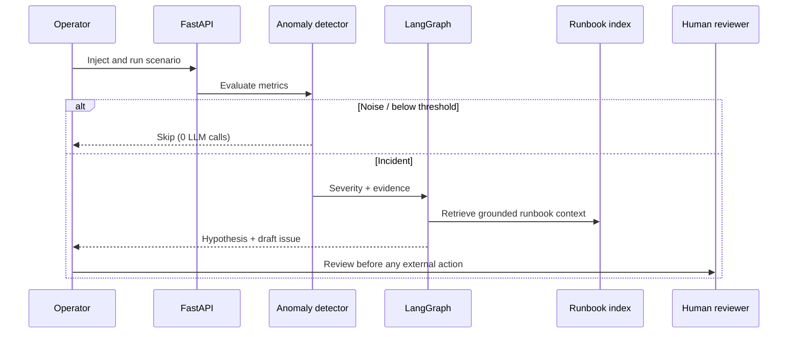

# IR-Copilot — Deep Dive

## Purpose

IR-Copilot is a constrained incident-response demonstration. It turns a synthetic metric scenario into an operator-reviewable root-cause hypothesis and draft remediation artifact. It is designed to show where deterministic control should remain in charge when adding AI to operational workflows.

## Request flow



## Control boundaries

| Concern | Guardrail |
| --- | --- |
| Alert decision | Classical z-score, threshold, and composite rules; detector code does not import LLM clients. |
| Agent behavior | Fixed LangGraph edges—no supervisor or unbounded loops. |
| Model use | `gpt-4o-mini`, temperature 0, maximum three calls per incident. |
| Retrieval | Local MiniLM embeddings and Chroma-backed runbook corpus. |
| GitHub | Draft-only; `GITHUB_DRY_RUN=true` by default and repository allowlisting when configured. |
| Infrastructure | No deploy, merge, delete, `kubectl`, or cloud-mutation tool exists. |

## Validation

The offline test suite covers detector behavior, graph call budgets, API behavior, RAG, GitHub dry-run behavior, and the evaluation harness. Golden evaluations cover five scenarios; the noise scenario verifies the system stops before any model call.

```bash
make test
make eval
```

## Local operation

`make install` installs the Python environment with `uv` and web dependencies. `make run-api` launches FastAPI on port 8000 and `make run-web` starts the Vite interface on port 5173. `make index-runbooks` indexes the local runbook corpus when indexing is enabled.

## Limits by design

- Scenarios and metric data are synthetic, so this is a workflow demonstration rather than a production monitoring platform.
- The hosted demo uses a FakeLLM to stay keyless and predictable.
- Runbooks are local and narrow in scope.
- Human review remains required for every externally visible artifact.

## Further reading

| Topic | Document |
| --- | --- |
| Architecture | [docs/ARCHITECTURE.md](docs/ARCHITECTURE.md) |
| Decisions and tradeoffs | [docs/DECISIONS.md](docs/DECISIONS.md) |
| Product walkthrough | [docs/DEMO_SCRIPT.md](docs/DEMO_SCRIPT.md) |
| Interview narrative | [docs/INTERVIEW_GUIDE.md](docs/INTERVIEW_GUIDE.md) |
| Deployment | [docs/DEPLOY.md](docs/DEPLOY.md) |
| Retrospective | [docs/RETROSPECTIVE.md](docs/RETROSPECTIVE.md) |
