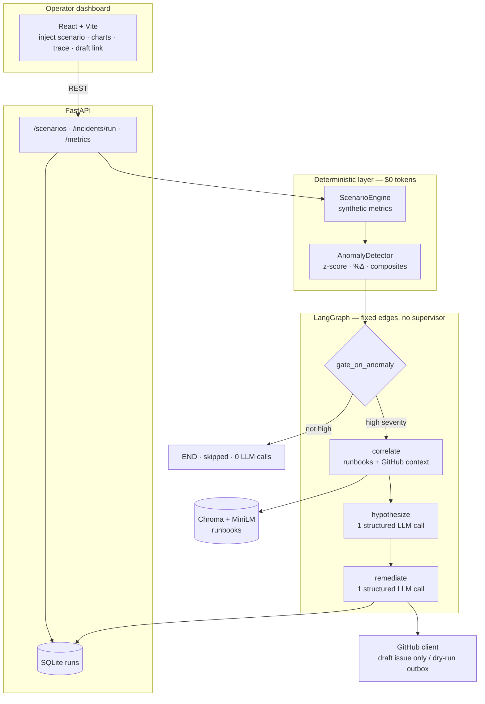

# IR-Copilot

**Detect with stats. Diagnose with agents. Remediate with humans.**

[Live demo](https://ir-copilot.onrender.com) · [Interview guide](docs/INTERVIEW_GUIDE.md) · [Architecture](docs/ARCHITECTURE.md)

> Free Render demo may take ~1 minute to wake after idle.

---

## Executive summary

On-call engineers still stitch metrics, runbooks, and tickets by hand under time pressure. **IR-Copilot** automates the safe middle of that loop:

1. **Stats decide** if something is actually anomalous (no LLM guessing at spikes)
2. **A fixed LangGraph pipeline** retrieves runbooks, forms a structured root-cause hypothesis, and drafts a GitHub issue
3. **A human reviews** — never auto-merge, never infra mutation

Built for entry-level FDE / Applied AI storytelling: integrations, guardrails, evals, and cost discipline — not an unbounded agent toy.

| | |
|---|---|
| **Stack** | FastAPI · LangGraph · React/Vite · Chroma · SQLite |
| **LLM** | `gpt-4o-mini` only · ≤3 calls/run · FakeLLM for keyless demos |
| **Evals** | `5/5` golden scenarios · noise path uses **0** LLM calls |
| **Deploy** | Single Docker service on [Render Free](https://ir-copilot.onrender.com) |

---

## System design



**Core idea:** the model never answers “is this a spike?” — only “given this grounded evidence, what is the likely cause and draft?”

---

## Pipeline

| Step | Who | LLM? | Output |
|---|---|---|---|
| Inject scenario | Dashboard / API | No | Metric series |
| Detect | `AnomalyDetector` | No | Severity + rule id |
| Gate | LangGraph | No | Skip or continue |
| Correlate | Tools | No* | Evidence pack (runbooks + GH context) |
| Hypothesize | Structured output | **1 call** | Root cause JSON |
| Remediate | Structured output + GH tool | **1 call** | Draft issue / outbox markdown |

\*Correlation is tool orchestration; FakeLLM demos skip loading MiniLM to stay memory-light on free tier.

---

## Quickstart

```sh
make install && make test
make run-api    # :8000
make run-web    # :5173 — or open the live demo
```

Select `sc_db_pool` → **Inject** → **Run**. Noise scenario `sc_noise_false_alarm` should show `skipped` with `llm_calls=0`.

```sh
make eval
# evals PASS: 5/5 exact, noise_skip=True, mean_cost=$0.0000
```

---

## Guardrails

- No supervisor agent / unbounded loops
- Draft-only GitHub (`GITHUB_DRY_RUN=true` by default) — no merge, deploy, kubectl, or cloud mutation tools
- Model allowlist + hard call budget
- Offline tests with FakeLLM; hosted demo needs **no paid API keys**

---

## Docs

| Doc | Purpose |
|---|---|
| [DEMO_SCRIPT.md](docs/DEMO_SCRIPT.md) | 3- and 8-minute walkthroughs |
| [INTERVIEW_GUIDE.md](docs/INTERVIEW_GUIDE.md) | Resume / interview answers |
| [ARCHITECTURE.md](docs/ARCHITECTURE.md) | Deeper diagrams |
| [DECISIONS.md](docs/DECISIONS.md) | ADR / tradeoffs |
| [DEPLOY.md](docs/DEPLOY.md) | Render Free hosting |
| [RETROSPECTIVE.md](docs/RETROSPECTIVE.md) | What broke and how we fixed it |
