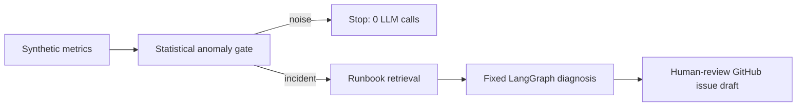

<h1 align="center">IR-Copilot</h1>

<p align="center"><strong>A human-in-the-loop incident assistant that detects with statistics, diagnoses from grounded evidence, and drafts—not executes—remediation.</strong></p>

<p align="center">
  <a href="https://ir-copilot.onrender.com"><strong>Open live demo</strong></a> ·
  <a href="DEEP_DIVE.md">Deep dive</a> ·
  <a href="docs/DEMO_SCRIPT.md">Demo script</a>
</p>

> The hosted demo runs on Render Free; its first request after idle can take about a minute.



## The project in one minute

IR-Copilot helps an on-call engineer investigate a known incident scenario. Classical statistics determine whether an anomaly exists; only then does a fixed, bounded agent graph correlate evidence, form a structured hypothesis, and draft a GitHub issue for review. It has no autonomous remediation capability.

| Stage | Owner | Outcome |
| --- | --- | --- |
| Detect | z-score, thresholds, composite rules | Severity or an intentional no-op |
| Diagnose | Fixed LangGraph + local runbook retrieval | Evidence-grounded root-cause hypothesis |
| Remediate | Human approval | Draft issue or local outbox artifact—never deploys or merges |

## Why it is built this way

- **Models do not decide whether an alert is real.** The anomaly gate is deterministic and makes zero calls on noise.
- **The agent is deliberately bounded.** Fixed edges, `gpt-4o-mini` only, temperature 0, and a hard maximum of three LLM calls per incident.
- **Remediation is draft-only.** GitHub dry-run is the default; there are no cloud-mutation, deploy, merge, or `kubectl` tools.
- **It is demoable without paid APIs.** Hosted mode uses a FakeLLM while preserving the real control flow.

## Try it

Open the [live demo](https://ir-copilot.onrender.com), choose **`sc_db_pool`**, then **Inject** and **Run**. The dashboard shows the metrics, decision path, evidence, and draft artifact.

## Run locally

```bash
git clone https://github.com/asorari09/Incident-Rootcause-Copilot.git
cd Incident-Rootcause-Copilot
make install && make test
make run-api   # http://127.0.0.1:8000
make run-web   # http://127.0.0.1:5173
```

```bash
make eval
```

The evaluation suite contains five golden scenarios; the noise path asserts zero LLM calls. See [DEEP_DIVE.md](DEEP_DIVE.md) for architecture, evaluation, scope, and document map.
