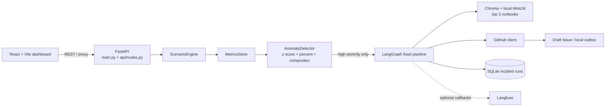
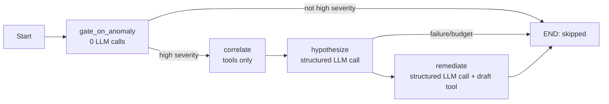
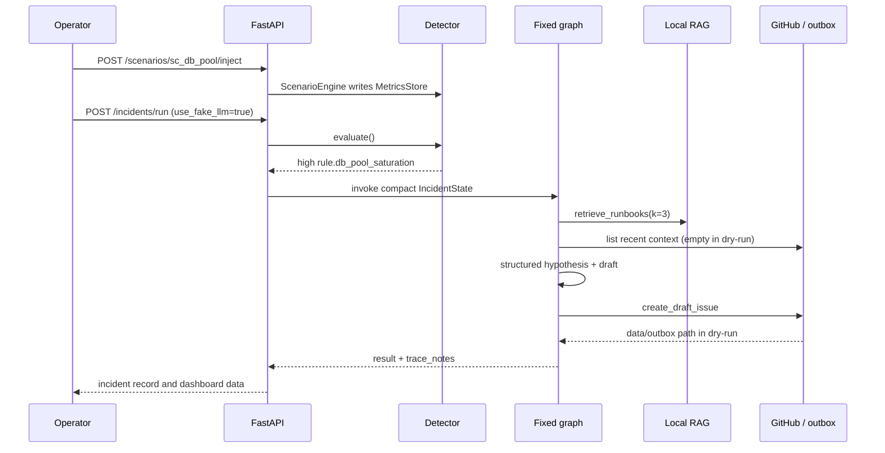

# IR-Copilot architecture

## Runtime shape

The repository ships synthetic metrics only. `apps/api/src/ir_copilot/scenarios/engine.py` produces five reproducible scenarios; `detection/detector.py` evaluates them without importing an LLM client.

## Fixed graph

`graph/state.py` contains compact fields only: incident/scenario IDs, metric snapshot, anomaly, retrieved chunks, GitHub context, structured result, trace notes, error, and `llm_calls`. The normal path is two calls; the third is reserved for one structured-output retry. `MAX_LLM_CALLS_PER_RUN` cannot exceed three.

## Inject-to-draft sequence

## Deployment boundary

The root `Dockerfile` builds `apps/web` and copies its `dist` output to `/app/web_dist`; `main.py` serves it only when present. API routes are registered first. The first container boot can skip local Chroma indexing for the free demo. `render.yaml` configures the single Docker service and `/health` check used by Render.
